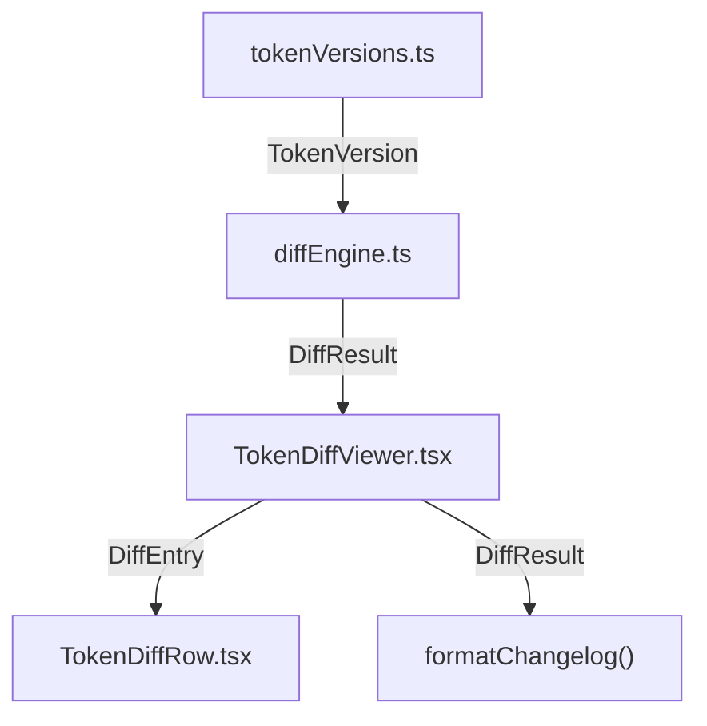

# Token Diff Viewer

## Overview

The **Token Diff Viewer** is a React component that lets designers and developers compare design-token palettes across two releases. It visualises which tokens were added, removed, or changed between any pair of version snapshots, including colour-swatch previews, WCAG luminance deltas, and human-readable impact-scope badges.

The component exists to make design-system auditing transparent: anyone can pick two versions from a dropdown, see an instant summary of changes, filter or search the results, and copy a Markdown changelog to paste into release notes.

---

## Usage

```tsx
import TokenDiffViewer from '@/components/TokenDiffViewer';

function DesignSystemPage() {
  return (
    <main>
      <TokenDiffViewer />
    </main>
  );
}
```

The component is fully self-contained — it sources its own version data from `tokenVersions.ts` and requires **no props**. Import via the barrel export:

```tsx
import { TokenDiffViewer } from '@/components/TokenDiffViewer';
```

---

## Component API

### `TokenDiffViewer`

| Prop | Type | Required | Description |
|------|------|----------|-------------|
| *(none)* | — | — | The main component accepts no props. It manages all state internally (version selection, filter, search, clipboard). |

**Rendered structure:**

- `<section aria-label="Token Diff Viewer">` — root wrapper
  - Version selectors (`<select>`) with a swap button
  - Summary statistics pills (added / removed / changed / unchanged)
  - Toolbar: filter tabs, search input, copy-changelog button
  - Diff row list (`role="table"`)

### `TokenDiffRow`

| Prop | Type | Required | Description |
|------|------|----------|-------------|
| `entry` | `DiffEntry` | ✅ | A single diff entry describing one token's status. See the `DiffEntry` union type below. |

**`DiffEntry` union type** (from `diffEngine.ts`):

```ts
type DiffEntry =
  | { type: 'added';     name: string; value: string; category: TokenCategory }
  | { type: 'removed';   name: string; value: string; category: TokenCategory }
  | { type: 'changed';   name: string; oldValue: string; newValue: string;
      category: TokenCategory; contrastDelta: number | null }
  | { type: 'unchanged'; name: string; value: string; category: TokenCategory };
```

Each row renders:

1. **Status icon** — colour-blind-safe symbol (`+`, `−`, `↔`, `=`)
2. **Token name** — the CSS custom-property name
3. **Swatch comparison** — old → new colour preview (or a "val" placeholder for non-colour tokens)
4. **Contrast delta** — absolute WCAG luminance shift (for changed colour tokens)
5. **Impact scope badge** — human-readable label (e.g. "Brand Identity", "Surfaces & Cards")

---

## Architecture

```
src/components/TokenDiffViewer/
├── index.ts               ← barrel re-export
├── tokenVersions.ts       ← versioned token snapshots & lookup helpers
├── diffEngine.ts          ← pure diff computation, colour math, changelog formatter
├── TokenDiffRow.tsx        ← individual row rendering (status, swatches, delta, scope)
├── TokenDiffViewer.tsx     ← orchestrator (state, filtering, search, clipboard)
└── TokenDiffViewer.css     ← all styles (BEM naming, responsive breakpoints)
```

### Module responsibilities

| Module | Responsibility |
|--------|----------------|
| **`tokenVersions.ts`** | Stores historical `TokenVersion` snapshots. Exports `TOKEN_VERSIONS` array, `getVersion(id)`, and `getVersionIds()`. Each version contains an array of `TokenEntry` objects with `name`, `value`, and `category`. |
| **`diffEngine.ts`** | Pure-function utilities: `computeTokenDiff()` produces a `DiffResult` by comparing two `TokenVersion` objects. Also exports colour helpers (`parseHex`, `relativeLuminance`, `contrastRatio`, `computeContrastDelta`, `meetsAA`, `isColor`) and `formatChangelog()` for Markdown export. |
| **`TokenDiffRow.tsx`** | Presentational component. Receives a single `DiffEntry` and renders the status icon, token name, old/new swatches with labels, contrast delta (with a warning class when Δ > 0.1), and an impact-scope badge via `getImpactScope()`. |
| **`TokenDiffViewer.tsx`** | Stateful orchestrator. Manages `fromId`, `toId`, `filter`, `search`, and `copied` state. Derives the filtered/searched entry list with `useMemo`. Renders version selectors, summary statistics, filter tabs, search input, copy button, and the diff row list. Handles empty states (no versions selected, same version, no changes, no matches). |
| **`TokenDiffViewer.css`** | Styles using BEM convention. Includes responsive breakpoints at 768 px and 480 px, focus-ring styles, `prefers-reduced-motion` media query, and colour-coded status pills. |

### Data flow



---

## Features

| Feature | Description |
|---------|-------------|
| **Version selector with swap** | Two `<select>` dropdowns (From / To) with a `⇄` swap button to quickly reverse the comparison direction. |
| **Summary statistics** | Four coloured pills showing counts: `+ added`, `− removed`, `↔ changed`, `= unchanged`. |
| **Filter tabs** | Tab bar (`role="tablist"`) with options: All, Added, Removed, Changed. Each tab shows a count badge. |
| **Search by token name** | Type-ahead search input (`type="search"`) that case-insensitively filters the visible entries by token name. |
| **Copy changelog as Markdown** | Copies a formatted Markdown changelog to the clipboard using `navigator.clipboard.writeText()`. Shows a `✓ Copied` confirmation for 2 seconds. |
| **Old-vs-new swatch comparison** | For colour tokens (`#hex`), renders a side-by-side coloured swatch with an arrow (`→`). Non-colour tokens show a "val" placeholder. |
| **Computed contrast delta** | For changed colour tokens, displays the absolute WCAG 2.1 relative-luminance delta (Δ). Values > 0.1 receive a visual warning class. |
| **Impact scope badges** | Each row shows a human-readable label derived from the token's `category` (e.g. `'brand'` → "Brand Identity", `'text'` → "Typography & Readability"). |

---

## Accessibility (WCAG 2.1 AA)

The Token Diff Viewer is designed to meet **WCAG 2.1 Level AA** conformance:

| Requirement | Implementation |
|-------------|----------------|
| **Visible focus rings** | All interactive elements (buttons, selects, inputs) display a `3px solid var(--color-focus-ring)` outline on `:focus-visible`. |
| **Keyboard navigation** | Full Tab-order through all controls. Enter/Space activates buttons and tabs. Search input supports native keyboard interaction. |
| **ARIA labels** | Every interactive element has an explicit `aria-label` (e.g. "Baseline version", "Swap versions", "Search tokens by name", "Copy changelog to clipboard"). |
| **Role attributes** | `tablist` and `tab` for filter buttons; `table` and `row` for the diff list; `status` for empty-state messages; `img` for swatches and status icons; `group` for version selectors and stats. |
| **Colour-blind safety** | Status types use distinct Unicode symbols (`+`, `−`, `↔`, `=`) plus text labels — **never colour alone**. See [Color-Blind Safe Design](#color-blind-safe-design). |
| **Screen reader support** | All swatches carry descriptive `aria-label` values (e.g. `"Old value: #067d99"`). Decorative icons use `aria-hidden="true"`. |
| **Reduced motion** | All CSS transitions and animations are disabled when `prefers-reduced-motion: reduce` is active. |

---

## Responsive Behavior

The component adapts to three viewport tiers:

### Desktop (> 768 px)

- Full grid layout with side-by-side version selectors.
- Diff rows display in a horizontal grid: icon | name | swatches | delta | scope.
- Filter tabs and search sit side-by-side in the toolbar.

### Tablet (≤ 768 px)

- Version selectors stack vertically.
- Filter tabs wrap to full width.
- Toolbar elements stack.

### Mobile (≤ 480 px)

- Diff rows stack into a single-column layout.
- Title font size reduces for readability.
- Swatch pairs stack vertically within each row.

---

## Color-Blind Safe Design

The component **never relies on colour alone** to communicate status. Each diff-entry type is identified by a combination of:

| Status | Symbol | Text Label | CSS Class |
|--------|--------|------------|-----------|
| Added | `+` | "Added" | `token-diff-row__icon--added` |
| Removed | `−` | "Removed" | `token-diff-row__icon--removed` |
| Changed | `↔` | "Changed" | `token-diff-row__icon--changed` |
| Unchanged | `=` | "Unchanged" | `token-diff-row__icon--unchanged` |

The summary statistics pills similarly pair an icon symbol with a text count (e.g. `+ 3 added`). Decorative icons use `aria-hidden="true"` so screen readers announce only the text label.

This approach ensures the interface is usable for users with protanopia, deuteranopia, tritanopia, and achromatopsia.

---

## Adding a New Token Version

To add a new version to the diff viewer:

### 1. Define the token array

Open `src/components/TokenDiffViewer/tokenVersions.ts` and add a new `TokenEntry[]` array at the bottom of the version data section:

```ts
const v004Tokens: TokenEntry[] = [
  { name: '--color-surface-canvas', value: '#fafafa', category: 'surface' },
  { name: '--color-text-primary',   value: '#18181b', category: 'text' },
  // … add all tokens for this release
];
```

### 2. Register the version

Append an entry to the `TOKEN_VERSIONS` array:

```ts
export const TOKEN_VERSIONS: TokenVersion[] = [
  { id: 'v0.0.1', label: 'v0.0.1 — Initial Release',      date: '2025-09-01', tokens: v001Tokens },
  { id: 'v0.0.2', label: 'v0.0.2 — Dark-Mode Refinement',  date: '2025-12-15', tokens: v002Tokens },
  { id: 'v0.0.3', label: 'v0.0.3 — Brand Refresh',         date: '2026-04-20', tokens: v003Tokens },
  // ✅ Add the new version here:
  { id: 'v0.0.4', label: 'v0.0.4 — Accessibility Audit',   date: '2026-08-01', tokens: v004Tokens },
];
```

### 3. Use a consistent `id` format

Version IDs must be unique strings. The convention is semver: `v0.0.N`.

### 4. Verify

Run the diff viewer in the browser, select your new version in the "To" dropdown, and confirm the diff renders correctly.

### 5. Update tests

Add any new categories or edge cases to the test suite. See [Testing](#testing).

---

## Testing

### Running tests

```bash
npx vitest run src/components/TokenDiffViewer/
```

### Watch mode

```bash
npx vitest watch src/components/TokenDiffViewer/
```

### Coverage

```bash
npx vitest run --coverage src/components/TokenDiffViewer/
```

**Coverage target: 95%+**

### Test files

| File | Scope |
|------|-------|
| `diffEngine.test.ts` | Unit tests for `computeTokenDiff`, `formatChangelog`, `parseHex`, `relativeLuminance`, `contrastRatio`, `computeContrastDelta`, `meetsAA`, `isColor`, `getImpactScope`. |
| `TokenDiffViewer.test.tsx` | Integration tests for the full component: rendering, version selection, swap, filtering, search, clipboard copy, empty states, and accessibility attributes. |

### What the tests cover

- **Diff engine**: correct classification of added / removed / changed / unchanged tokens, contrast delta calculation for colour and non-colour values, changelog Markdown formatting, hex parsing edge cases (3-, 4-, 6-, 8-digit), WCAG luminance formula accuracy.
- **Component**: initial render with default versions selected, version swap, filter tab activation, search narrowing, empty-state messages (no selection, same version, no changes, no matches), clipboard write, ARIA roles and labels, swatch rendering for colour vs. non-colour tokens.
